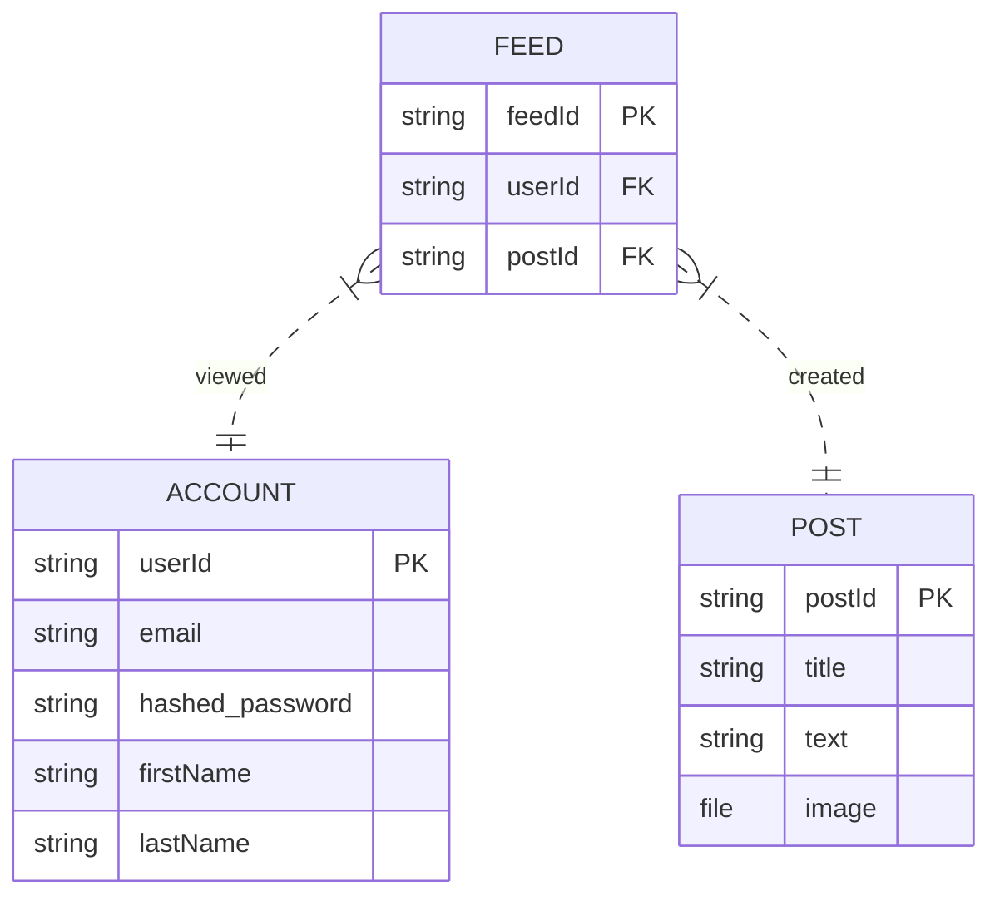

# groupomania-backend
Backend Application for the Groupomania Employee Forum 

Initial API Spec: 
API Endpoints

Flow: 
- Account creation 
- Account sign in
- Display information
- Scroll through information
- View account info
- Edit account info
- Delete account
- Create multimedia post
- Create text post
- View all posts (know If they have been viewed or not)

/accounts/v1/
Account Endpoints:
- POST : create a new account
- POST : sign into an account (/login)

/accounts/v1/{id}
- PUT : update account information
- GET : account information
- DELETE  : delete account

/groupomania-feed/v1/
Information Endpoints:

- GET : display all employee posts
- GET : dynamic display of all posts  ? 

Pass user-id through payload
/groupomania-feed/v1/new-post
- POST : create a new post

/groupomania-feed/v1/{post-id}
- PUT :  update post (text or multimedia) ( needed ? )
- DELETE : remove a post 

SQL ERD:

https://mermaid.live/edit#pako:eNp1kttqwzAMQH9F6Ln0A_I22hTGoC20ewsMESuNWW7IyrrR5N_nlWxNMsdPMufYutg3TGvDGCHL1tJFqEwq-FvjeBfHW-i79brr4GmzObzuzxF8WL6yWdKOh5N3UmHSsfSIhnvgNr4BwKnY6gKtY3k2cHyZ0AFySbYIgZxczuatIeeutZiQkllxuqeSQ7CgOeuT6rG59xeuN2M2_-uddbML06Z2OqOTtD-jXEg7HF1Iq1YLDhP-VJiSzBYMtqTLtPuxgissWfzwjf8094IS1Jz9vDDyoSF5TzCpeu-1jfEPHxurtWCUUeF4hdRqffqqUoxUWv6Vhr83WP03j362-g

`
CREATE TABLE account (
    email VARCHAR(40) PRIMARY KEY,
    hashed_password CHAR(60) NOT NULL,
    first_name CHAR(20) NOT NULL,
    last_name CHAR(20) NOT NULL
);

CREATE TABLE post (
    post_id VARCHAR(16) NOT NULL CONSTRAINT post_id_unique UNIQUE PRIMARY KEY,
    FOREIGN KEY (email) REFERENCES account (email),
    title VARCHAR(20) NOT NULL,
    text_body VARCHAR(1024) NOT NULL
);

CREATE TABLE feed (
    feed_id  VARCHAR(16) NOT NULL CONSTRAINT feed_id_unique UNIQUE PRIMARY KEY,
    FOREIGN KEY (email) REFERENCES account (email),
    FOREIGN KEY (post_id) REFERENCES post (post_id),
)
`

